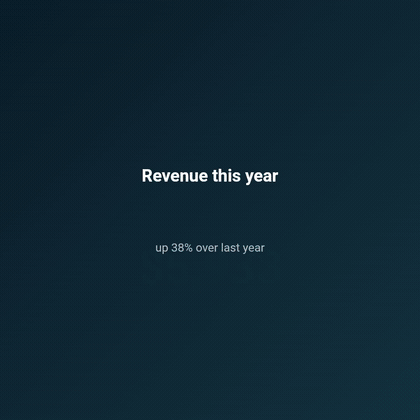

<p align="center">
  
</p>

<p align="center"><strong>You write widgets. Fluvie shoots the film.</strong></p>

<p align="center">
  <a href="https://pub.dev/packages/fluvie"></a>
  <a href="https://github.com/SimonErich/fluvie/actions/workflows/ci.yaml"></a>
  <a href="https://codecov.io/gh/SimonErich/fluvie"></a>
  <a href="LICENSE"></a>
  <a href="https://melos.invertase.dev"></a>
</p>

**Fluvie is a Flutter package that turns widget code into real video files.** You
build a video the way you build a screen, with `Scene`s and the Flutter widgets
you already know, you say how long each thing lasts, and Fluvie renders every
frame and encodes it into an MP4 (or a GIF, or an image sequence) with FFmpeg. No
video editor, no manual timeline, no After Effects.

Think of it as a tiny film studio that already speaks Flutter: you direct, Fluvie
handles continuity, and FFmpeg runs the projector. No timeline to scrub, no
keyframe spreadsheet, no 2am debugging because frame 412 is one pixel off.

- **Declarative.** Compose `Scene`s and elements like any Flutter screen.
- **Cacheable.** The frame cache keys on content, so caching, golden tests, and batch rendering just work.
- **Headless.** Render from the CLI, an HTTP API, or an MCP server. No display needed.
- **Conversational.** Describe a video in plain language; a model writes editable Fluvie code (or a spec) and renders it.

## Quick start

This is lesson 01, in full: about 16 lines of widgets become a 4 second clip.

<table>
<tr>
<td>

```dart
import 'package:flutter/material.dart' hide Animation;
import 'package:fluvie/fluvie.dart';

Video helloVideo() => Video(
  size: VideoSize.square,
  poster: 1.seconds,
  scenes: [
    Scene(
      duration: 4.seconds,
      background: Background.gradient(
        const [Color(0xFF1A2980), Color(0xFF26D0CE)],
      ),
      children: [
        const Text(
          'Hello, Fluvie',
          style: TextStyle(color: Colors.white, fontSize: 72),
        ).animate([Animation.fadeIn(), Animation.pop()]),
      ],
    ),
  ],
);
```

</td>
<td align="center" width="330">

</td>
</tr>
</table>

```sh
dart pub global activate fluvie_cli
fluvie init                            # scaffold a runnable starter (or add one to your app)
fluvie render starter --out starter.mp4
```

`fluvie init` writes a starter video in real Flutter code and wires everything to
preview, render, and test it. You do not need to install FFmpeg: the first render
downloads a pinned, checksum-verified build and caches it (run
`fluvie ffmpeg install` to fetch it ahead of time, or point `--ffmpeg` /
`FLUVIE_FFMPEG` at your own). The
[getting started guide](https://docs.fluvie.dev/getting-started/start-a-project/)
walks through it. Full source:
[`example/lib/lessons/01_hello_video.dart`](example/lib/lessons/01_hello_video.dart).

## See what it can do

These snippets are trimmed to the shape of the thing; each links to its full,
runnable lesson. The clips beside them were rendered by Fluvie.

### Charts that reveal themselves

<table>
<tr>
<td>

```dart
Video chartsVideo() => Video(
  size: VideoSize.square,
  scenes: [
    Scene(duration: 3.seconds, children: [
      Chart.bar(
        data: {'Q1': 42, 'Q2': 58, 'Q3': 71, 'Q4': 96},
        growIn: 1.seconds,
      ),
    ]),
    Scene(duration: 3.seconds, children: [
      Chart.line(data: {'W1': 12, 'W2': 26, /* ... */}, drawIn: 1500.ms),
    ]),
    Scene(duration: 2500.ms, children: [
      Chart.donut(
        data: {'Search': 48, 'Social': 27, /* ... */},
        sweepIn: 1.seconds,
      ),
    ]),
  ],
);
```

</td>
<td align="center" width="330">

</td>
</tr>
</table>

Full source: [`example/lib/lessons/07_charts.dart`](example/lib/lessons/07_charts.dart).

### Layers and scenes, set to a beat

Several scenes play one after another with a cross-fade. Each scene stacks
layers: a full-frame effect under the content, a chip that pops on the music
beat, captions over the top.

<table>
<tr>
<td>

```dart
Video reel() => Video(
  size: VideoSize.reels, // 9:16
  transition: Transition.crossFade(0.4.seconds),
  audio: [Audio.music('beat.wav', track: music)],
  captions: const Captions.fromSrt('captions.srt'),
  scenes: [
    Scene(children: [
      Box(/* ... */).animate([
        Animation.pop(at: Trigger.beat(track: music)),
      ]),
      const Text('On the beat').animate([Animation.fadeIn()]),
    ]),
    Scene(children: [
      const ColoredBox(/* ... */).animate([Animation.grain(0.12)]),
      Counter(to: 12000, duration: 1500.ms),
    ]),
    Scene.centered(child: /* ... outro ... */),
  ],
);
```

</td>
<td align="center" width="330">

</td>
</tr>
</table>

Full source: [`example/lib/lessons/12_the_kitchen_sink.dart`](example/lib/lessons/12_the_kitchen_sink.dart).

## Examples

Twelve runnable lessons live in [`example/lib/lessons/`](example/lib/lessons),
from "Hello, Fluvie" to the kitchen sink. Try them at
[demo.fluvie.dev](https://demo.fluvie.dev): write and render a `Video` in the
**Playground**, or describe one in the **AI Assistant** and let a model write and
render the code. Or run the gallery locally:

```sh
flutter run --enable-impeller   # from the repo root; Impeller for the live preview
```

> Use Impeller (`--enable-impeller`) whenever you run or preview Fluvie on the
> desktop. It is Flutter's current renderer and draws shaders, grain, and blends
> the way the final video does. The headless render pipeline already handles this
> for you. See [Troubleshooting](#troubleshooting).

## Packages

**Most people only need `fluvie`.** The rest are there when you want to render in
CI, on a server, or from an AI assistant.

| Package | Role | pub.dev |
| --- | --- | --- |
| [`fluvie`](packages/fluvie) | The library. Describe a video, render an MP4. | [](https://pub.dev/packages/fluvie) |
| [`fluvie_cli`](packages/fluvie_cli) | Headless renderer. Capture with `flutter test`, encode with FFmpeg. | [](https://pub.dev/packages/fluvie_cli) |
| [`fluvie_lints`](packages/fluvie_lints) | Lint rules that catch timing and layering mistakes. | [](https://pub.dev/packages/fluvie_lints) |
| [`fluvie_ai`](packages/fluvie_ai) | Author a video from a prompt. A model writes a spec. | [](https://pub.dev/packages/fluvie_ai) |
| [`fluvie_server`](packages/fluvie_server) | One self-hostable server: render API (local or S3), MCP server, and a docs helper, plus a web-safe client. | [](https://pub.dev/packages/fluvie_server) |
| [`fluvie_mobile_encoder`](packages/fluvie_mobile_encoder) | Render to MP4 fully on-device on Android and iOS, no FFmpeg. | [](https://pub.dev/packages/fluvie_mobile_encoder) |
| [`fluvie_web_encoder`](packages/fluvie_web_encoder) | Render to MP4 fully in the browser with ffmpeg.wasm, opt-in. | [](https://pub.dev/packages/fluvie_web_encoder) |

## Rendering modes by platform

The same `Video` renders three ways. Pick by where the encode should run: on your
own machine, on a server you call, or on the user's own device.

| Platform | Local (FFmpeg binary) | Server API | On-device |
| --- | --- | --- | --- |
| Desktop (Linux/macOS/Windows) | ✅ [`fluvie_cli`](https://docs.fluvie.dev/getting-started/installation/) | ✅ [`fluvie_server` client](https://docs.fluvie.dev/guides/rendering-on-a-server/) | ✅ local FFmpeg (the CLI itself) |
| Android | — | ✅ [`fluvie_server` client](https://docs.fluvie.dev/guides/rendering-on-a-server/) | ✅ [`fluvie_mobile_encoder`](https://docs.fluvie.dev/guides/on-device-mobile-rendering/) (native) |
| iOS | — | ✅ [`fluvie_server` client](https://docs.fluvie.dev/guides/rendering-on-a-server/) | ✅ [`fluvie_mobile_encoder`](https://docs.fluvie.dev/guides/on-device-mobile-rendering/) (native) |
| Web (browser) | — | ✅ [`fluvie_server` client](https://docs.fluvie.dev/guides/rendering-on-a-server/) | ✅ [`fluvie_web_encoder`](https://docs.fluvie.dev/guides/on-device-web-rendering/) (ffmpeg.wasm, opt-in) |

- **Local** runs FFmpeg on your own machine. It is the full feature set (audio,
  GIF, transparency) and the reference platform for golden images. This is the CLI
  and CI path.
- **Server API** keeps the client thin: the app sends a spec, a render server runs
  FFmpeg, the app gets a file back. It works on every platform and keeps app
  bundles small. Use it when you do not want to ship an encoder.
- **On-device** renders without a server, so the video never leaves the device.
  Mobile uses the platform's native encoder; web uses ffmpeg.wasm. The frames are
  captured by Fluvie's own pipeline, so they match a desktop render; only the
  encode edge differs (see each guide for the trade-offs).

**Combining platforms.** One Flutter app can run on mobile **and** web and render
on-device on both: choose the renderer per platform behind a conditional import
(`fluvie_mobile_encoder` on mobile, `fluvie_web_encoder` on web), passing the same
`Video`. On the web you trade bundle size for the ffmpeg.wasm payload; choose the
Server API instead to keep the bundle light.

**Audio works everywhere too.** Declare `Audio.music`/`Audio.sfx` once and it
mixes on every renderer — looping beds, fades, trims, and multi-track `amix` —
with audio opt-in on-device. The web has no local-file source (bundle as an asset
or fetch from an allowlisted URL). See the full
[audio support by platform](https://docs.fluvie.dev/guides/audio-and-captions/#audio-across-platforms)
table.

## The ecosystem

The library is the whole show. These hosted pieces are the lobby, the trailers,
and the box office.

| Where | What you get |
| --- | --- |
| [fluvie.dev](https://fluvie.dev) | The front of house: what Fluvie is, in one screen. |
| [docs.fluvie.dev](https://docs.fluvie.dev) | The manual: getting started, guides, a cookbook, and the full reference. |
| [demo.fluvie.dev](https://demo.fluvie.dev) | The screening room: try Fluvie live in the browser and render a clip. |
| [mcp.fluvie.dev](https://mcp.fluvie.dev) | The hosted MCP server, so an AI assistant can make videos with Fluvie. |

## Documentation

Start at [docs.fluvie.dev](https://docs.fluvie.dev):

- **[Getting started](https://docs.fluvie.dev/getting-started/installation/)**: install, your first video, the core ideas.
- **[Guides](https://docs.fluvie.dev/guides/animating-elements/)**: animation, audio, charts, code scenes, theming, exporting.
- **[Cookbook](https://docs.fluvie.dev/cookbook/)**: short, copy-paste recipes for one task each.
- **[AI and MCP](https://docs.fluvie.dev/guides/ai-and-mcp/)**: author from a prompt, run it locally, or point Claude at it.
- **[Reference](https://docs.fluvie.dev/reference/cheatsheet/)**: the whole public surface on one page.

## What goes in a video

Everything you can paint with Flutter, plus the things a video needs:

| Kind | What you get |
| --- | --- |
| Text | `Text`, `Typewriter`, `Counter`, `Markdown` |
| Code | `Code`, `CodeReveal` (animated diffs), `Terminal` |
| Media | `Image`, `Clip` (embedded video), `Snapshot`, `DeviceFrame` |
| Data | `Chart` (bar, line, area, pie, donut, scatter), `Bars` |
| Diagrams and web | `Mermaid`, `WebView`, `Html` |
| Annotations | `Shape`, `Arrow`, `Connector`, `Callout`, `Spotlight`, `LowerThird`, `TitleCard` |
| Motion and effects | 60+ animation presets, `Stagger`, `Camera`, shaders, particles, grain |
| Audio | `Audio` (music and sfx), beat detection, `Captions` (SRT and VTT) |
| Look | `Background` (color, gradient, image), `FluvieTheme`, multi-aspect export |

## What you can make with it

| Use case | For example |
| --- | --- |
| Product demos | feature walkthroughs, onboarding clips, changelog videos |
| Social reels | 9:16 vertical shorts for TikTok, Reels, and Shorts |
| Explainers | tutorials and concept animations |
| Data stories | stat highlight reels and animated reports |
| Developer content | code walkthroughs, terminal demos, release notes |
| Branding | title cards, intros, and lower thirds |

## Troubleshooting

**Text renders as solid white boxes.** That is Flutter's `Ahem` test font, which
draws every glyph as a filled box, so each word looks like a bar. It means the
real fonts were not loaded before the frames were captured. Fluvie's own render
pipeline (the CLI, the API, and the Docker image) loads them for you. If you
write your own capture harness, load the app fonts and set a real default font
family before rendering (see `example/test/render/`).

**Shaders, grain, or blends look off when you preview on the desktop.** Run with
Impeller, Flutter's current renderer:

```sh
flutter run --enable-impeller
```

Impeller draws fragment shaders and effects the way the encoded video does; the
software preview can differ. This is about the live desktop preview only. The
headless render pipeline produces the final frames correctly.

## Contributing

Pull up a chair. Read [CONTRIBUTING.md](CONTRIBUTING.md), install the hooks once,
and keep the gate green:

```sh
dart pub get && dart run melos bootstrap
bash .githooks/install.sh
CI=true dart run melos run gate
```

## Community

- [Discussions](https://github.com/SimonErich/fluvie/discussions): questions and ideas.
- [Issues](https://github.com/SimonErich/fluvie/issues): bugs and feature requests.
- [Code of Conduct](CODE_OF_CONDUCT.md) and [Security policy](SECURITY.md).

## License

[MIT](LICENSE) © 2026 Simon Auer.
